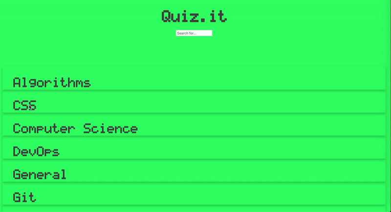

# Quiz.it

**Tech database for interview preparations.**

Quiz.it is a tech knowledge data base. It has flipping cards organized by dashboards. Each dashboard represents a tech topic, for example, JavaScript, Ruby, Networking, SQL, etc. Each card has a front and back sides. Front side is a tech question, for example, "What is Enumerable?". Back side has an answer to this question. Clicking on the card flips it over and displays the back side - the answer. Quiz.it was created using responsive design in order to be used on a mobile phone browser. Written in JavaScript/React on frontend and Ruby on Rails on a backend.

**Demo:** [YouTube]()

**Stack:**
> - Ruby on Rails;
> - JavaScript;
> - React;
> - HTML/CSS.

**How to run instructions:**
1. Fork and clone this Project's GitHub repository.  
2. Have current version of Ruby, Rails and Node installed.
3. Open a terminal and navigate into the backend folder:
* _Install required gems (listed in Gemfile) by running the command 'bundle install';_
* _Run the command 'rails db:create' which will create the database;_
* _Run the command 'rails db:migrate' which will do DB migrations;_
* _Run the command 'rails db:seed' which will populate the database with existing user/plan/lists/tasks data;_
* _Run the command 'rails s' to start backend server;_
4. Open a separate terminal window/tab and navigate into the frontend folder:
* _Run the command 'npm install' to install dependencies into the node_modules/ directory;_
* _Run the command 'npm start' to start frontend server._

**Future features:**
- [ ] login functionality;
- [ ] signup functionality;
- [ ] ability to create new dashboards;
- [x] search functionality.

**Quiz.it uses data provided by Flatiron instructors and was created for educational purposes only.**
**Created by Tatiana Smolin as part of a MOD4 Solo Project at Flatiron School.**
